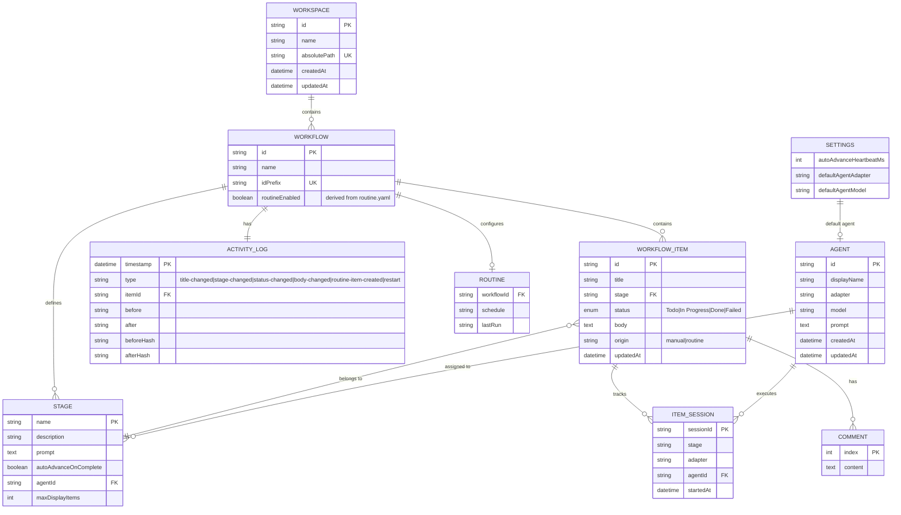

# Database Design

> Last updated: 2026-04-24

NOS uses a **file-based data model** with no external database. All state is persisted as YAML metadata files, Markdown content files, JSON configuration, and JSONL activity logs on the local filesystem. Atomic writes (temp file + rename) ensure consistency.

---

## Entity-Relationship Diagram



---

## Entities & Attributes

### Workspace
- **Storage**: `~/.nos/workspaces.yaml` (global registry, max 1MB)
- **Fields**: `id` (UUID), `name`, `absolutePath` (unique), `createdAt`, `updatedAt`
- **Constraints**: Path must be absolute and exist on filesystem

### Workflow
- **Storage**: `.nos/workflows/<id>/config.json`
- **Fields**: `id` (pattern: `^[a-z0-9][a-z0-9_-]{0,63}$`), `name` (max 128 chars), `idPrefix` (pattern: `^[A-Z0-9][A-Z0-9_-]{0,15}$`)
- **Indexes**: Looked up by directory name (id)

### Stage
- **Storage**: `.nos/workflows/<id>/config/stages.yaml` (ordered array)
- **Fields**: `name` (pattern: `^[A-Za-z0-9 _-]+$`, max 64 chars), `description`, `prompt` (nullable text), `autoAdvanceOnComplete` (nullable boolean), `agentId` (nullable FK to Agent), `maxDisplayItems` (nullable positive int, 0 = no limit), `skill` (nullable string, max 128 chars) — slash command/skill to invoke when stage runs
- **Constraints**: Name unique within workflow; order significant (first = default for new items); `skill` when set prepends `[Skill: /<skill-name>]` directive to the assembled prompt

### WorkflowItem
- **Storage**: `.nos/workflows/<id>/items/<itemId>/meta.yml` + `index.md`
- **meta.yml fields**: `title`, `stage`, `status`, `comments[]`, `sessions[]`, `updatedAt`
- **index.md**: Free-form Markdown body content
- **Status values**: `Todo`, `In Progress`, `Done`, `Failed`
- **Constraints**: `stage` must reference a valid stage name; `status` from allowed enum
- **ID generation**: `<idPrefix>-<zero-padded sequence number>` (e.g., `REQ-00042`)

### ItemSession
- **Storage**: Embedded in `WorkflowItem.sessions[]` array in `meta.yml`
- **Fields**: `stage`, `adapter`, `sessionId`, `startedAt` (ISO 8601), `agentId` (optional)
- **Constraints**: One active session per stage (deduplication in pipeline trigger)

### Comment
- **Storage**: Embedded in `WorkflowItem.comments[]` array in `meta.yml`
- **Fields**:
  - `text` (string) — Markdown content
  - `createdAt` (ISO 8601 string) — Timestamp when comment was created; must be single-quoted in YAML to avoid Date object parsing
  - `updatedAt` (ISO 8601 string) — Timestamp of last edit; equals `createdAt` initially
  - `author` (string) — Conventional values: `"agent"`, `"runtime"`, `"user"`; free-form string allows extensibility
- **Operations**: Append (POST), update by index (PATCH), delete by index (DELETE)
- **Migration**: Legacy plain-string comments are lazily migrated on read to `{ text, createdAt: now, updatedAt: now, author: 'agent' }`
- **Constraints**: ISO timestamps must be single-quoted in YAML; `js-yaml` otherwise parses them as JavaScript Date objects

### Agent
- **Storage**: `.nos/agents/<id>/meta.yml` + `index.md`
- **meta.yml fields**: `id`, `displayName`, `adapter` (nullable), `model` (nullable), `createdAt`, `updatedAt`
- **index.md**: Agent prompt template (Markdown)
- **ID generation**: Slugified from displayName (pattern: `^[a-z0-9]+(?:-[a-z0-9]+)*$`)
- **Constraints**: Cannot delete if referenced by any stage's `agentId`

### ActivityLog
- **Storage**: `.nos/workflows/<id>/activity.jsonl` (append-only, line-delimited JSON)
- **Fields per entry**: `timestamp` (ISO 8601), `type` (enum), `itemId`, `title`, type-specific before/after fields
- **Entry types**: `title-changed`, `stage-changed`, `status-changed`, `body-changed`, `routine-item-created`, `restart`
- **Query**: Supports `before` cursor and `limit` (clamped 1u2013500) for pagination

### Settings
- **Storage**: `.nos/settings.yaml` (max 64KB)
- **Fields**: `autoAdvanceHeartbeatMs` (default 60000), `defaultAgent` object (`adapter`, `model`)
- **Constraints**: Atomic writes; ENOENT-tolerant reads with defaults

### Routine
- **Storage**: `.nos/workflows/<id>/config/routine.yaml` + `routine-state.json`
- **Fields**: Schedule configuration and last-run state

---

## File System Layout

```
~/.nos/
  workspaces.yaml              # Global workspace registry

<project-root>/.nos/
  system-prompt.md             # Global agent system prompt
  settings.yaml                # Global settings
  agents/
    <agent-id>/
      meta.yml                 # Agent metadata
      index.md                 # Agent prompt template
  workflows/
    <workflow-id>/
      config.json              # Workflow metadata (name, idPrefix)
      config/
        stages.yaml            # Ordered stage definitions
        routine.yaml           # (Optional) Routine configuration
      items/
        <item-id>/
          meta.yml             # Item metadata (title, stage, status, comments, sessions)
          index.md             # Item body (Markdown)
      activity.jsonl           # Append-only activity log
      routine-state.json       # (Optional) Routine execution state
  runtime/
    server.json                # Active session tracking
    server.log                 # Runtime logs
```

---

## Write Semantics

- **Atomic writes**: All YAML/JSON/Markdown writes use `writeFile(path + '.tmp')` followed by `rename(path + '.tmp', path)` to prevent partial writes.
- **No locking**: Single-process model; concurrent external edits detected via chokidar and reconciled with last-writer-wins semantics.
- **Append-only logs**: Activity JSONL is append-only; entries are never rewritten or deleted.
- **Size caps**: Settings u226464KB, workspaces u22641MB.
