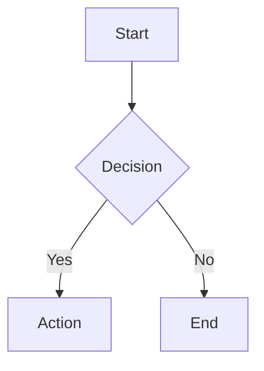

# Documentation Standards

> Last updated: 2026-04-22 (AUDIT-004)

---

## 1. Markdown Conventions

### Recommended Patterns

- **Frontmatter metadata.** All documents should include YAML frontmatter with `title`, `last updated`, and relevant metadata.
- **Consistent heading hierarchy.** Use `#` for title, `##` for major sections, `###` for subsections.
- **Tables for structured data.** Use Markdown tables for lists, comparisons, and specifications.
- **Code blocks with language hints.** Always specify the language for syntax highlighting.

### Frontmatter Template

```yaml
---
title: Document Title
description: Brief description
last updated: YYYY-MM-DD
---
```

### File Naming

| Document Type | Convention | Example |
|---|---|---|
| Standards | `kebab-case.md` | `error-handling-strategy.md` |
| Architecture | `kebab-case.md` | `system-architecture.md` |
| ADRs | `ADR-###-title.md` | `ADR-008-atomic-file-writes.md` |
| Requirements | `REQ-#####.md` | `REQ-00088.md` |
| Guides | `kebab-case.md` | `getting-started.md` |

---

## 2. Code Examples

### Recommended Patterns

- **Include file paths.** Always indicate which file the code belongs to.
- **Show relevant context.** Include enough surrounding code for understanding.
- **Use comments sparingly.** Only explain non-obvious details.

### Format

````markdown
```typescript
// file: lib/example.ts
import { foo } from './foo';

export function example(): string {
  return foo('test');
}
```
````

---

## 3. Diagrams

### Recommended Patterns

- **Mermaid for flowcharts.** Use Mermaid diagrams for process flows, sequence diagrams, and architecture diagrams.
- **ASCII art for simple tables.** Use ASCII tables only when Markdown tables are insufficient.

### Mermaid Example

````markdown

````

---

## 4. Links and References

### Recommended Patterns

- **Relative links.** Use relative paths for internal links.
- **Descriptive link text.** Avoid "click here" - use descriptive text.
- **Cross-reference related docs.** Link to related standards documents.

### Format

```markdown
See [API Reference](api-reference.md) for details.
See [ADR-008](adr/ADR-008-atomic-file-writes.md) for rationale.
```

---

## 5. Gap Summaries

### Recommended Patterns

- **Tabular format.** Use tables for gap/tracking items.
- **Status badges.** Use consistent status indicators (OPEN, RESOLVED, PARTIAL).
- **Priority levels.** Include priority for each gap.

### Format

```markdown
| ID | Description | Status | Priority |
|----|-------------|--------|----------|
| GAP-01 | Brief description | OPEN | High |
```

---

## 6. Anti-Patterns to Avoid

- **Hardcoded dates.** Use relative time references or dates in ISO format.
- **Duplicate information.** Reference other documents rather than repeating.
- **Outdated screenshots.** Use text descriptions or diagrams over screenshots.
- **Generated content.** Don't commit auto-generated documentation.
- **Unmaintained docs.** Mark outdated information clearly or remove it.

---

## 7. Standards Document Checklist

When creating or updating a standards document, ensure:

- [ ] Frontmatter with `title` and `last updated`
- [ ] Clear heading hierarchy
- [ ] Tables for structured data
- [ ] Code examples with file paths
- [ ] Cross-references to related documents
- [ ] Anti-patterns section if applicable
- [ ] Gap summary table if tracking items

---

## 8. Audit Integration

Documentation is audited through the `audit` workflow with stages:

1. **Standards Audit** - Verify tech stack and standards are current
2. **Naming Convention** - Check file/class naming consistency
3. **Code Pattern** - Review implementation patterns
4. **Documentation** - Audit documentation completeness
5. **Fix** - Apply fixes for identified issues

Each audit item in `.nos/workflows/audit/items/` includes:
- `meta.yml` - Audit metadata and findings
- `index.md` - Detailed findings and remediation notes
