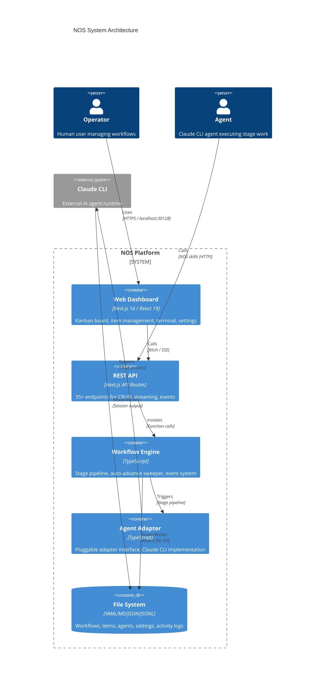
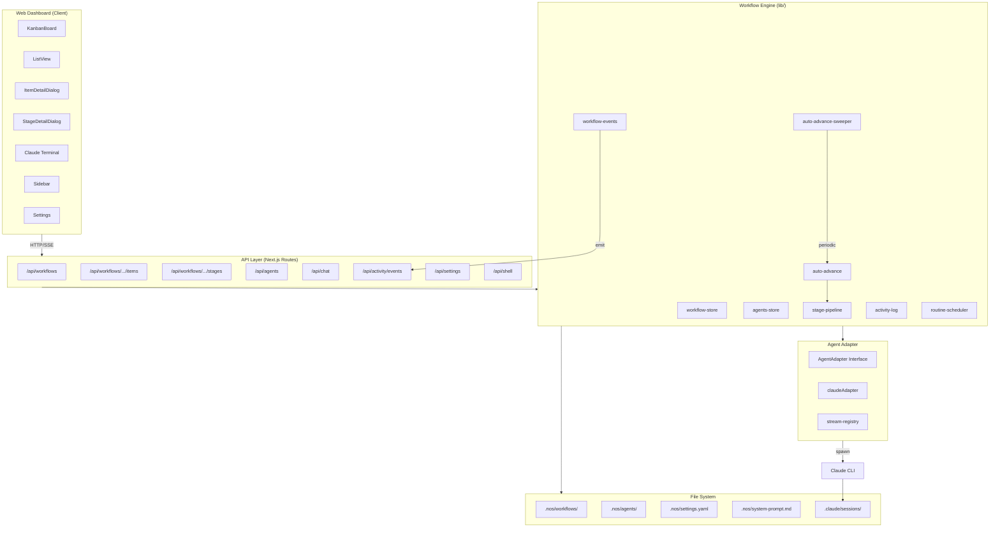
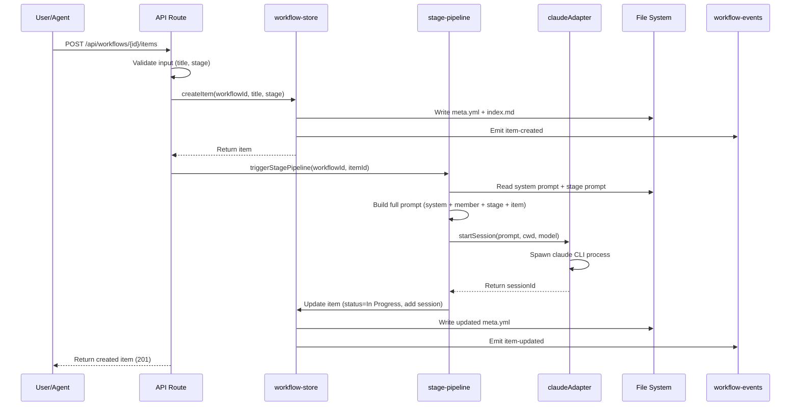
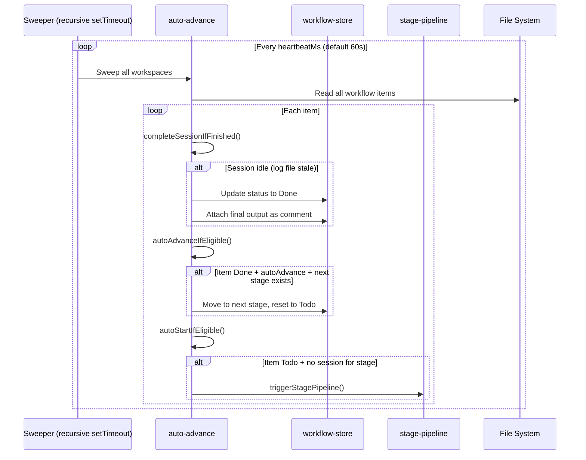
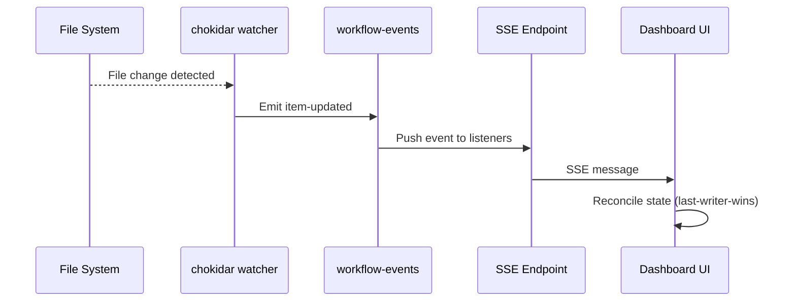
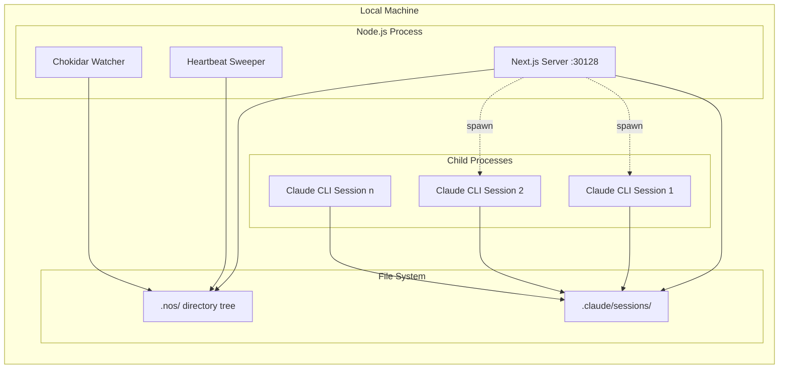

# System Architecture

> Last updated: 2026-04-21

---

## High-Level Component Diagram

---

## Component Architecture

---

## Data Flow

### Item Creation Flow

### Heartbeat Auto-Advance Flow

### Real-Time Event Flow

---

## Deployment Topology

NOS is a **local-only application**. All components run on the operator's machine:
- **Single Node.js process**: Next.js server handling HTTP/SSE + heartbeat sweeper + file watcher
- **Child processes**: Claude CLI agents spawned on demand per stage pipeline trigger
- **File system**: All state persisted locally in `.nos/` directory tree
- **No external services**: No database, no cloud APIs (except Claude CLI's own API calls)

---

## Integration Points

| Integration | Protocol | Direction | Description |
|-------------|----------|-----------|-------------|
| Web Dashboard u2192 API | HTTP/SSE | Client u2192 Server | Dashboard fetches data and subscribes to events |
| API u2192 Workflow Engine | Function call | Internal | API routes invoke store/pipeline functions directly |
| Workflow Engine u2192 Claude CLI | Process spawn | Server u2192 Child | Agent adapter spawns `claude` as child process |
| Claude CLI u2192 NOS API | HTTP | Child u2192 Server | Agents use NOS skills (nos-create-item, etc.) via HTTP |
| Chokidar u2192 Event System | File watch | FS u2192 Server | External file edits detected and emitted as events |
| Heartbeat Sweeper u2192 Engine | Timer | Internal | Periodic sweep for session completion and auto-advance |

---

## Key Design Decisions

| Decision | Rationale |
|----------|-----------|
| File-based storage | Local-only tool; no need for database; human-readable YAML/Markdown |
| Atomic writes | Prevent corruption from partial writes; temp file + rename pattern |
| SSE for real-time | Simpler than WebSockets; uni-directional server-to-client sufficient |
| Claude CLI adapter | Leverage existing Claude Code CLI; avoid direct API integration |
| Heartbeat sweeper | Catch stranded sessions; complement event-triggered auto-advance |
| AsyncLocalStorage | Thread workspace context through API handlers without prop drilling |
| Last-writer-wins | Simple conflict resolution for concurrent edits (single user expected) |
