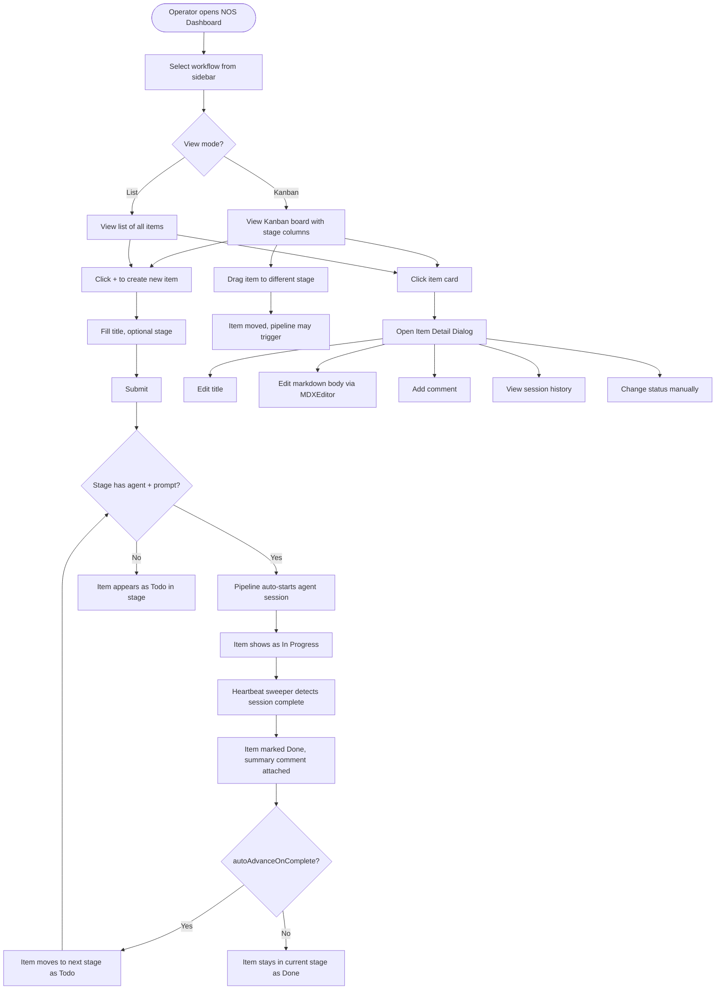
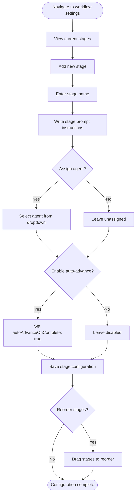
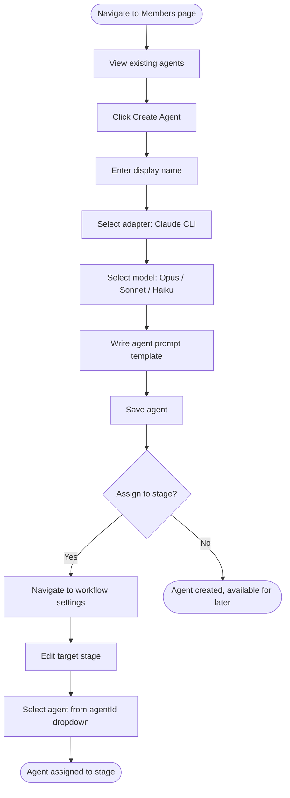
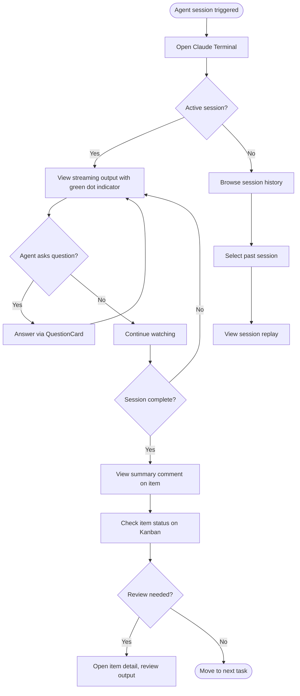
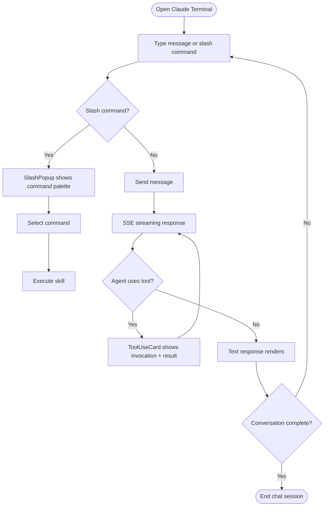
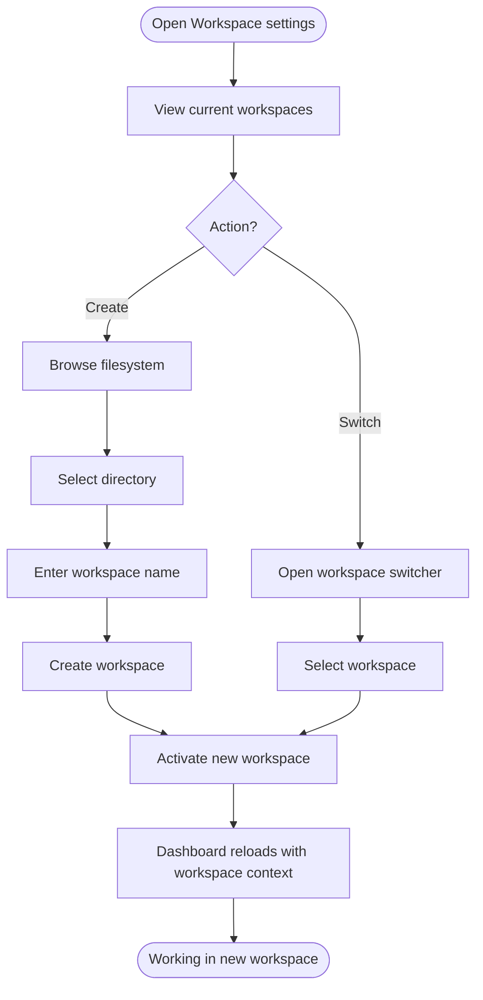
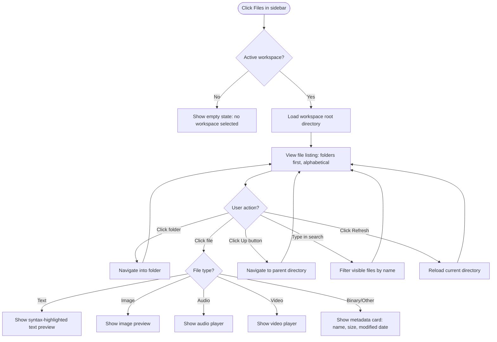
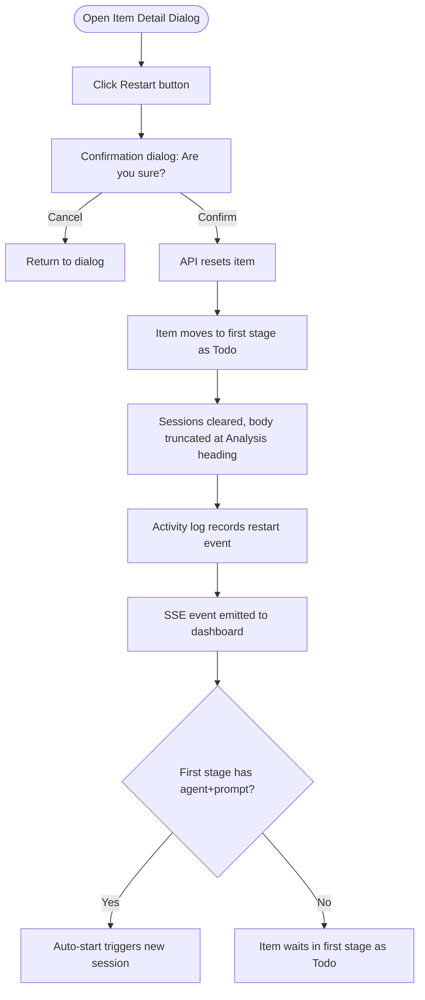

# User Journey

> Last updated: 2026-04-24

---

## Primary User Journeys

### Journey 1: Manage Workflow Items (Operator)

### Journey 2: Configure Workflow Pipeline (Operator)

### Journey 3: Create and Assign Agents (Operator)

### Journey 4: Monitor Agent Execution (Operator)

### Journey 5: Interactive Chat with Agent (Operator)

### Journey 6: Workspace Management (Operator)

### Journey 7: Browse Project Files (Operator)

### Journey 8: Restart a Workflow Item (Operator)

---

## Entry Points

| Entry Point | URL | Description |
|-------------|-----|-------------|
| Home | `/` | Landing page, redirects to dashboard |
| Dashboard | `/dashboard` | Main dashboard with overview |
| Workflows | `/dashboard/workflows` | Workflow list |
| Workflow Detail | `/dashboard/workflows/[id]` | Kanban/List view for specific workflow |
| Workflow Settings | `/dashboard/workflows/[id]/settings` | Stage and workflow configuration |
| Terminal | `/dashboard/terminal` | Claude Terminal for agent interaction |
| Members | `/dashboard/agents` | Agent management |
| Settings | `/dashboard/settings` | Global settings (system prompt, heartbeat) |
| Activity | `/dashboard/activity` | Global activity feed |
| Files | `/dashboard/files` | File system browser with preview |
| Workspaces | `/dashboard/workspaces` | Workspace management |

---

## Decision Points

| Decision | Options | Impact |
|----------|---------|--------|
| View mode | Kanban vs. List | Different UI for same data; persisted per session |
| Auto-advance | Enable vs. disable per stage | Controls whether Done items auto-move to next stage |
| Agent assignment | Assign agent or leave manual | Determines whether pipeline auto-triggers on items |
| Status override | Manual status change | Bypasses normal lifecycle; useful for stuck items |
| Workspace switch | Select different workspace | Changes project root; all data context switches |
| Restart item | Confirm restart | Resets item to first stage; clears sessions; may re-trigger pipeline |

---

## Exit States

| State | Condition | Next Action |
|-------|-----------|-------------|
| Item Done (final stage) | Item completed in last pipeline stage | Operator reviews and archives |
| Item Done (mid-pipeline) | Item completed with auto-advance enabled | System auto-moves to next stage |
| Item Failed | Agent reports FAILED: in summary | Operator investigates, may reset to Todo |
| Session Stranded | Agent process crashed without clean exit | Heartbeat sweeper detects and marks Done |
| Pipeline Idle | No Todo items in stages with agents | System quiescent until new items created |
| Item Restarted | Item reset to first stage as Todo | Pipeline re-triggers if first stage has agent |
